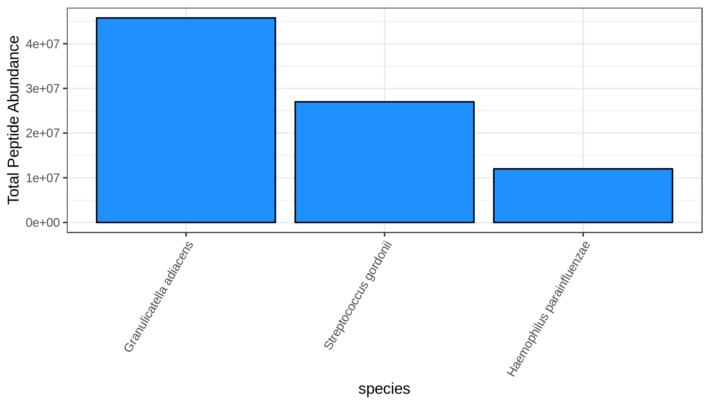
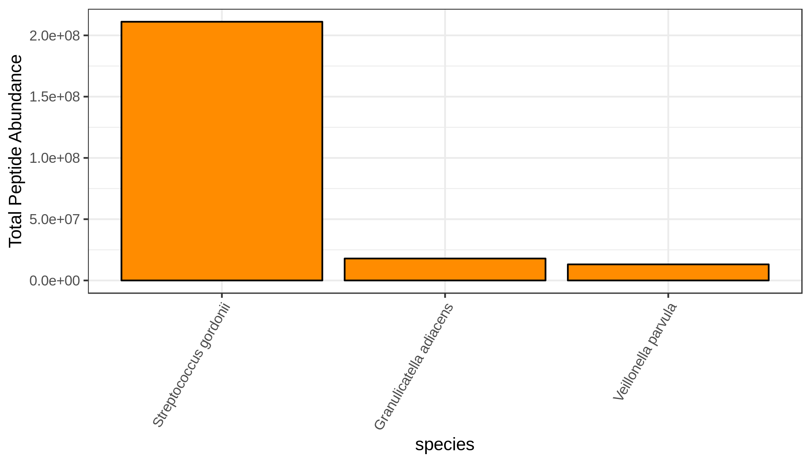
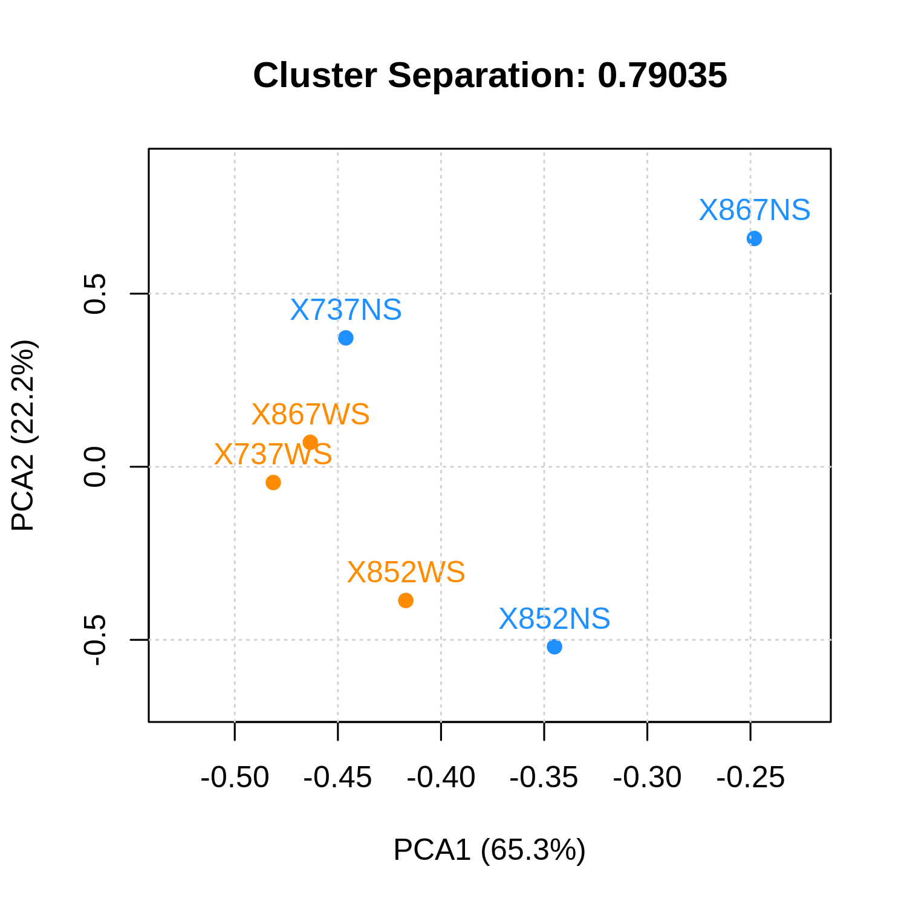
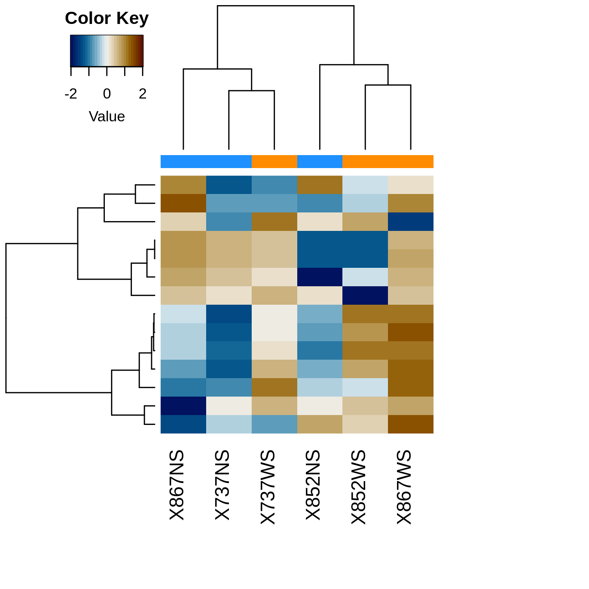
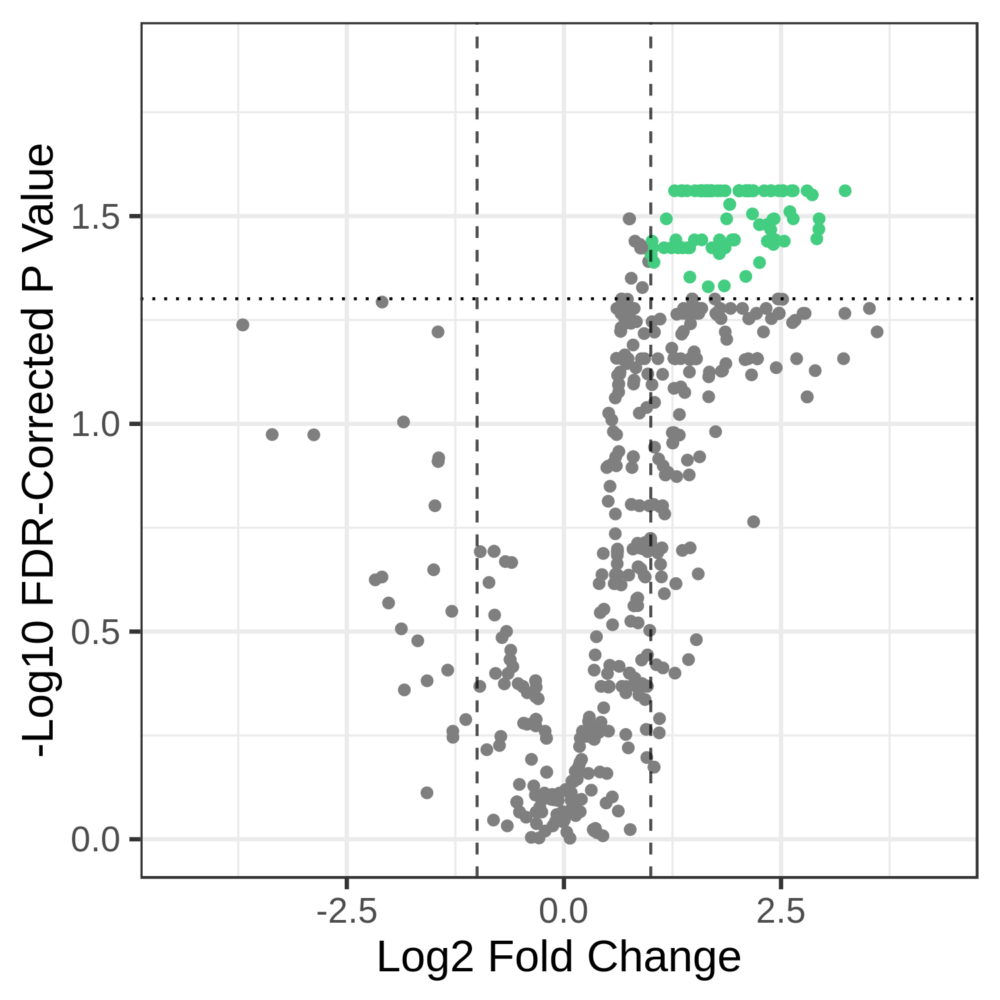
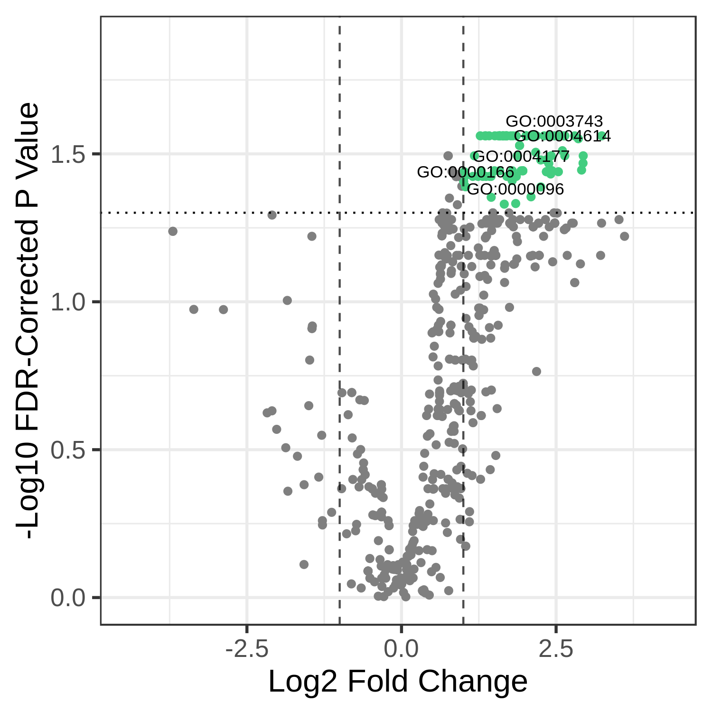
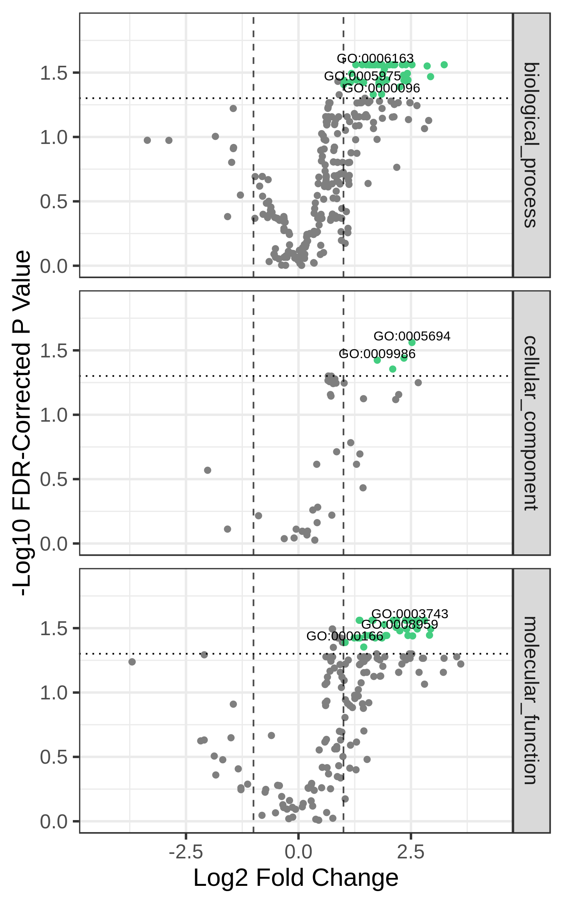
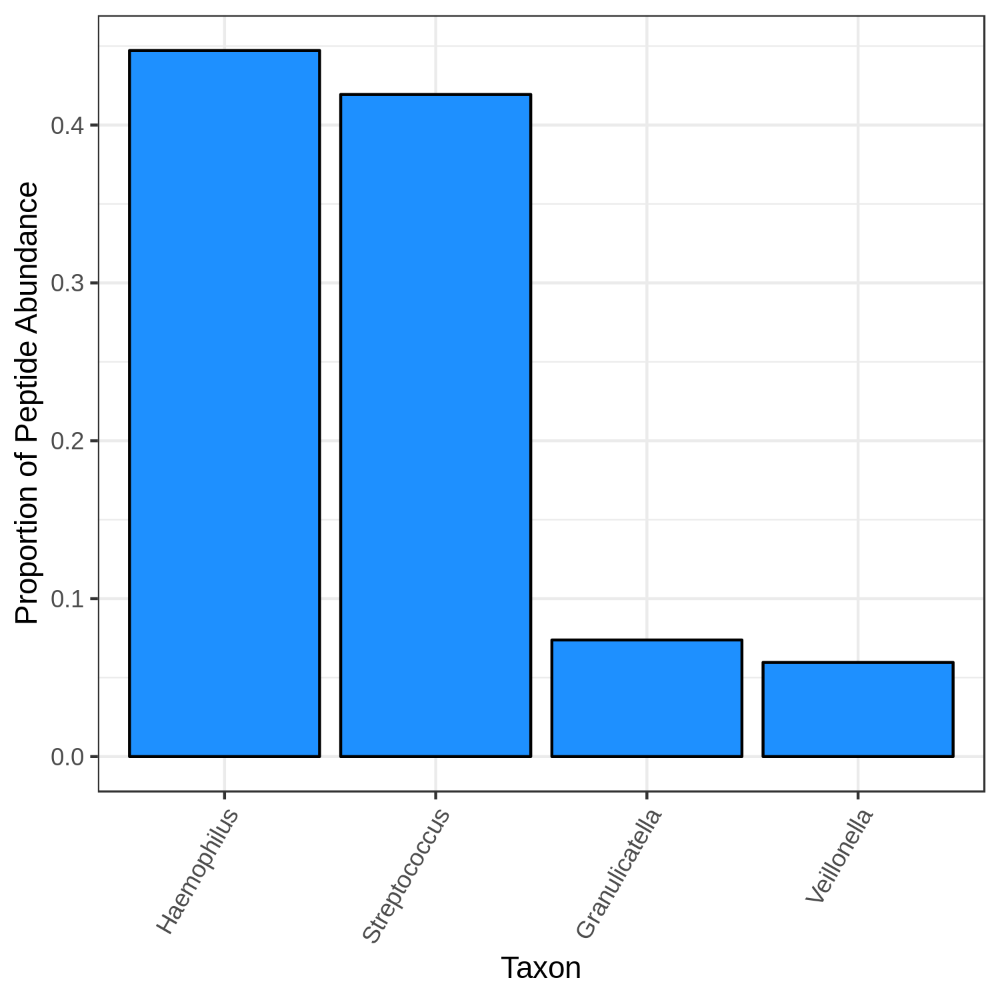
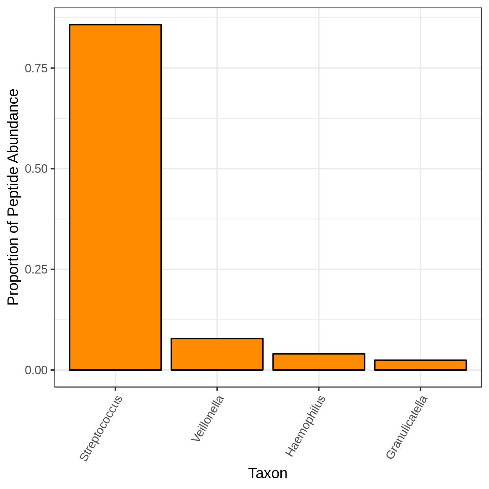

metaQuantome Command-line Tutorial
================
Caleb W. Easterly, Ray Sajulga, Subina Mehta, James Johnson, Praveen Kumar, Shane Hubler, Bart Mesuere, Joel Rudney, Timothy J. Griffin, Pratik D. Jagtap
April 19, 2019

[go back to the main page](../README.md)

Introduction
============

This tutorial accompanies the article Easterly et al., *Mol Cell Proteomics* 2019, and is designed to show how to use the metaQuantome command line interface. An introduction to the metaQuantome Galaxy tool interface is available [here](../galaxy_tutorial/tutorial.md).

Installing metaQuantome
=======================

The easiest way to install metaQuantome with all the dependencies is by using Bioconda (provided you are on Mac or Linux, which are the only systems supported by Bioconda).

First, install the conda package manager, by downloading either Anaconda or Miniconda (see <https://docs.anaconda.com/anaconda/install/>). Then, the following commands will set up the necessary channels for Bioconda and metaQuantome. If needed, additional information on Bioconda is available at <https://bioconda.github.io/>.

``` bash
conda config --add channels defaults
conda config --add channels bioconda
conda config --add channels conda-forge
```

Then, run the following command to set up an environment named `mqome`, which will have metaQuantome (version 1.0.0) and all dependencies in it:

``` bash
conda create -n mqome metaquantome=1.0.0
```

If the following prompt is seen at the command line, type `y`:

``` bash
Proceeed ([y]/n)?
```

The `create` command only needs to be run once.

Finally, we can activate the environment using the following command, which will make the `metaquantome` command available.

``` bash
source activate mqome
```

The rest of the tutorial will assume that you have the Conda environment activated, and are on a Mac or Linux system. Furthermore, you can follow along with the tutorial by cloning the Github repository at <https://github.com/galaxyproteomics/metaquantome_mcp_analysis> and changing your directory to `<git_repo_root>/cli_tutorial`. If you have any problems, please submit an issue at <https://github.com/galaxyproteomics/metaquantome/issues>.

The data
========

metaQuantome takes 2-3 input files depending on the mode of analysis. In the case of functional analysis, metaQuantome takes in a functional annotation file and a file with peptide intensities. For taxonomic analysis, the peptide intensity file and a file with lowest common ancestor (LCA) peptide annotations. For function-taxonomy interaction analysis, metaQuantome takes in all three files above. In addition,

In this tutorial, the data is from a previously published paper \[1\], and is downsampled in the interest of speed and simplicity - so, keep in mind that these results are by not necessarily representative. The purpose of this tutorial is to demonstrate the capabilities of metaQuantome, not to analyze the full dataset. We can see the beginning of each of the files below.

Function
--------

<table class="table table-striped" style="margin-left: auto; margin-right: auto;">
<thead>
<tr>
<th style="text-align:left;">
peptide
</th>
<th style="text-align:left;">
go
</th>
</tr>
</thead>
<tbody>
<tr>
<td style="text-align:left;">
LPGQQHGTPSAK
</td>
<td style="text-align:left;">
GO:0009405,GO:0019867
</td>
</tr>
<tr>
<td style="text-align:left;">
ELPGLAALTDK
</td>
<td style="text-align:left;">
GO:0006096,GO:0005737,GO:0004618,GO:0005524
</td>
</tr>
<tr>
<td style="text-align:left;">
ELADASVSTIEIER
</td>
<td style="text-align:left;">
GO:0006412,GO:0015935,GO:0003735,GO:0019843,GO:0003729
</td>
</tr>
<tr>
<td style="text-align:left;">
QISAGELR
</td>
<td style="text-align:left;">
GO:0006412,GO:0005840,GO:0022625,GO:0003735,GO:0003729
</td>
</tr>
<tr>
<td style="text-align:left;">
VPAILADATK
</td>
<td style="text-align:left;">
GO:0055085
</td>
</tr>
</tbody>
</table>

Note that there can be multiple GO terms (or no GO terms) annotated to a peptide, as long as they are separated by a comma.

Taxonomy
--------

<table class="table table-striped" style="margin-left: auto; margin-right: auto;">
<thead>
<tr>
<th style="text-align:left;">
peptide
</th>
<th style="text-align:left;">
lca
</th>
</tr>
</thead>
<tbody>
<tr>
<td style="text-align:left;">
LPGQQHGTPSAK
</td>
<td style="text-align:left;">
Veillonella
</td>
</tr>
<tr>
<td style="text-align:left;">
ELPGLAALTDK
</td>
<td style="text-align:left;">
Bacteria
</td>
</tr>
<tr>
<td style="text-align:left;">
ELADASVSTIEIER
</td>
<td style="text-align:left;">
Bacteria
</td>
</tr>
<tr>
<td style="text-align:left;">
QISAGELR
</td>
<td style="text-align:left;">
Bacteria
</td>
</tr>
<tr>
<td style="text-align:left;">
VPAILADATK
</td>
<td style="text-align:left;">
Granulicatella adiacens
</td>
</tr>
</tbody>
</table>

Here, the peptides are annotated with their lowest common ancestor as a NCBI taxonomy ID. Taxon names can also be used, but, unlike names, NCBI taxIDs are unambiguous and not affected by differences in capitalization or spelling errors. So, taxIDs are *highly* recommended.

Peptide intensities
-------------------

Here, the mass-spectrometer spectral intensities are provided for each peptide.

<table class="table table-striped" style="margin-left: auto; margin-right: auto;">
<thead>
<tr>
<th style="text-align:left;">
peptide
</th>
<th style="text-align:right;">
X737WS
</th>
<th style="text-align:right;">
X737NS
</th>
<th style="text-align:right;">
X852WS
</th>
<th style="text-align:right;">
X852NS
</th>
<th style="text-align:right;">
X867WS
</th>
<th style="text-align:right;">
X867NS
</th>
</tr>
</thead>
<tbody>
<tr>
<td style="text-align:left;">
LPGQQHGTPSAK
</td>
<td style="text-align:right;">
160259.9
</td>
<td style="text-align:right;">
334347.7
</td>
<td style="text-align:right;">
NA
</td>
<td style="text-align:right;">
NA
</td>
<td style="text-align:right;">
564647.6
</td>
<td style="text-align:right;">
402888.9
</td>
</tr>
<tr>
<td style="text-align:left;">
ELPGLAALTDK
</td>
<td style="text-align:right;">
9640246.9
</td>
<td style="text-align:right;">
NA
</td>
<td style="text-align:right;">
6379355.0
</td>
<td style="text-align:right;">
1842767
</td>
<td style="text-align:right;">
5491673.7
</td>
<td style="text-align:right;">
NA
</td>
</tr>
<tr>
<td style="text-align:left;">
ELADASVSTIEIER
</td>
<td style="text-align:right;">
3957113.0
</td>
<td style="text-align:right;">
NA
</td>
<td style="text-align:right;">
238529.0
</td>
<td style="text-align:right;">
NA
</td>
<td style="text-align:right;">
1277833.8
</td>
<td style="text-align:right;">
165964.2
</td>
</tr>
<tr>
<td style="text-align:left;">
QISAGELR
</td>
<td style="text-align:right;">
17929965.5
</td>
<td style="text-align:right;">
774077.2
</td>
<td style="text-align:right;">
18109620.3
</td>
<td style="text-align:right;">
2481987
</td>
<td style="text-align:right;">
6576851.4
</td>
<td style="text-align:right;">
NA
</td>
</tr>
<tr>
<td style="text-align:left;">
VPAILADATK
</td>
<td style="text-align:right;">
NA
</td>
<td style="text-align:right;">
202338.2
</td>
<td style="text-align:right;">
447102.1
</td>
<td style="text-align:right;">
1892304
</td>
<td style="text-align:right;">
1049044.7
</td>
<td style="text-align:right;">
1696422.4
</td>
</tr>
</tbody>
</table>

Note that missing data is here represented as `NA`. In general, metaQuantome treats `0`, `NA`, and `NaN` as missing data.

Also, metaQuantome assumes that input data is untransformed and normalized - that is, the data should be on the original measurement scale (not log transformed or any other transformation), and it should be normalized by an appropriate method.

Databases
=========

metaQuantome has a separate module for downloading the necessary databases. Let's first get the helptext for the module and make sure everything is installed correctly:

``` bash
metaquantome db -h
```

    usage: metaquantome db [-h] [--dir DIR] [--update]
                           {ncbi,go,ec} [{ncbi,go,ec} ...]

    positional arguments:
      {ncbi,go,ec}       database to download. note that COG mode does not require
                         a download due to its simplicity.

    optional arguments:
      -h, --help         show this help message and exit
      --dir DIR, -d DIR  data directory for files.
      --update, -u       overwrite existing databases if present.

If you get any errors that suggest that there has been trouble installing the package, please post on <https://github.com/galaxyproteomics/metaquantome/issues>.

Now, to actually download the databases, choose a folder - here, `data` - and run the following command:

``` bash
mkdir -p ./data
metaquantome db ncbi go --dir ./data
```

As detailed in the manuscript, the are several questions that metaQuantome can be used to explore. Let's go through a few of these.

Most Abundant Taxa
==================

metaQuantome can be used to identify the most abundant taxa in an experiment, and stratify this by condition. The workflow here is

1.  `expand` the set of annotations to include indirect annotations
2.  `filter` the expanded results to well-supported taxa
3.  `viz` the filtered taxa, ranked by abundance.

Expand
------

metaQuantome requires information about each of the samples, and which experimental conditions they belong to. The names of the samples also should be the column names in the intensity file. For example, if you have two experimental conditions "A" and "B", each with two samples that you're calling "A1", "A2", and "B1", "B2", respectively, the columns of your intensity file should be `peptide` (or another peptide column name), `A1`,`A2`,`B1`, and `B2`. Then, the `--samps` argument gives metaQuantome the information about which samples below to which groups. There are two ways to provide this information to metaQuantome:

-   a JSON string
-   a tabular file

An example of the required tabular file is in `input_files/samples.tab`:

``` bash
cat input_files/samples.tab
```

    group   colnames
    NS  X737NS,X852NS,X867NS
    WS  X737WS,X852WS,X867WS

The file must have the 'group<tab>colnames\` header, and cannot end with a newline. Moreover, it must be separated with 'hard' tabs rather than 'soft tabs', as must all files used by metaQuantome. On the other hand, the JSON option is simpler for a smaller number of samples. The JSON equivalent in this case is

    '{"NS": ["X733NS","X852NS","X866NS"], "WS": ["X733WS", "X852WS", "X866WS"]}'

Note that the items in the JSON string must be surrounded by double quotes (e.g., `"thing"`).

Now, let's run the `expand` module on the files in `input_files`.

``` bash
metaquantome expand \
    --mode t \
    --int_file input_files/int.tab \
    --pep_colname_int peptide \
    --tax_file input_files/tax.tab \
    --pep_colname_tax peptide \
    --tax_colname lca \
    --samps input_files/samples.tab \
    --outfile mqome_outputs/tax_expanded.tab \
    --data_dir data
```

Note that many of the arguments give column names in the input files, so that metaQuantome can keep track of what's what. Specifically, it needs to know the name of the peptide column in each file (`--pep_colname_int`, `--pep_colname_tax`), and the name of the taxonomy least common ancestor column in the taxonomy file (`tax_colname`).

Let's look at the output in `mqome_outputs`:

<table class="table table-striped" style="margin-left: auto; margin-right: auto;">
<thead>
<tr>
<th style="text-align:right;">
id
</th>
<th style="text-align:left;">
taxon\_name
</th>
<th style="text-align:left;">
rank
</th>
<th style="text-align:right;">
NS\_mean
</th>
<th style="text-align:right;">
WS\_mean
</th>
<th style="text-align:right;">
X737NS
</th>
<th style="text-align:right;">
X737WS
</th>
<th style="text-align:right;">
X852NS
</th>
<th style="text-align:right;">
X852WS
</th>
<th style="text-align:right;">
X867NS
</th>
<th style="text-align:right;">
X867WS
</th>
<th style="text-align:right;">
X737NS\_n\_peptide
</th>
<th style="text-align:right;">
X737WS\_n\_peptide
</th>
<th style="text-align:right;">
X852NS\_n\_peptide
</th>
<th style="text-align:right;">
X852WS\_n\_peptide
</th>
<th style="text-align:right;">
X867NS\_n\_peptide
</th>
<th style="text-align:right;">
X867WS\_n\_peptide
</th>
<th style="text-align:right;">
X737NS\_n\_samp\_children
</th>
<th style="text-align:right;">
X737WS\_n\_samp\_children
</th>
<th style="text-align:right;">
X852NS\_n\_samp\_children
</th>
<th style="text-align:right;">
X852WS\_n\_samp\_children
</th>
<th style="text-align:right;">
X867NS\_n\_samp\_children
</th>
<th style="text-align:right;">
X867WS\_n\_samp\_children
</th>
</tr>
</thead>
<tbody>
<tr>
<td style="text-align:right;">
481
</td>
<td style="text-align:left;">
Neisseriaceae
</td>
<td style="text-align:left;">
family
</td>
<td style="text-align:right;">
21.18733
</td>
<td style="text-align:right;">
16.54774
</td>
<td style="text-align:right;">
22.09506
</td>
<td style="text-align:right;">
17.25113
</td>
<td style="text-align:right;">
18.17465
</td>
<td style="text-align:right;">
15.11985
</td>
<td style="text-align:right;">
NA
</td>
<td style="text-align:right;">
NA
</td>
<td style="text-align:right;">
1
</td>
<td style="text-align:right;">
1
</td>
<td style="text-align:right;">
1
</td>
<td style="text-align:right;">
1
</td>
<td style="text-align:right;">
NA
</td>
<td style="text-align:right;">
NA
</td>
<td style="text-align:right;">
1
</td>
<td style="text-align:right;">
1
</td>
<td style="text-align:right;">
1
</td>
<td style="text-align:right;">
1
</td>
<td style="text-align:right;">
NA
</td>
<td style="text-align:right;">
NA
</td>
</tr>
<tr>
<td style="text-align:right;">
538
</td>
<td style="text-align:left;">
Eikenella
</td>
<td style="text-align:left;">
genus
</td>
<td style="text-align:right;">
21.18733
</td>
<td style="text-align:right;">
16.54774
</td>
<td style="text-align:right;">
22.09506
</td>
<td style="text-align:right;">
17.25113
</td>
<td style="text-align:right;">
18.17465
</td>
<td style="text-align:right;">
15.11985
</td>
<td style="text-align:right;">
NA
</td>
<td style="text-align:right;">
NA
</td>
<td style="text-align:right;">
1
</td>
<td style="text-align:right;">
1
</td>
<td style="text-align:right;">
1
</td>
<td style="text-align:right;">
1
</td>
<td style="text-align:right;">
NA
</td>
<td style="text-align:right;">
NA
</td>
<td style="text-align:right;">
1
</td>
<td style="text-align:right;">
1
</td>
<td style="text-align:right;">
1
</td>
<td style="text-align:right;">
1
</td>
<td style="text-align:right;">
NA
</td>
<td style="text-align:right;">
NA
</td>
</tr>
<tr>
<td style="text-align:right;">
539
</td>
<td style="text-align:left;">
Eikenella corrodens
</td>
<td style="text-align:left;">
species
</td>
<td style="text-align:right;">
21.18733
</td>
<td style="text-align:right;">
16.54774
</td>
<td style="text-align:right;">
22.09506
</td>
<td style="text-align:right;">
17.25113
</td>
<td style="text-align:right;">
18.17465
</td>
<td style="text-align:right;">
15.11985
</td>
<td style="text-align:right;">
NA
</td>
<td style="text-align:right;">
NA
</td>
<td style="text-align:right;">
1
</td>
<td style="text-align:right;">
1
</td>
<td style="text-align:right;">
1
</td>
<td style="text-align:right;">
1
</td>
<td style="text-align:right;">
NA
</td>
<td style="text-align:right;">
NA
</td>
<td style="text-align:right;">
NA
</td>
<td style="text-align:right;">
NA
</td>
<td style="text-align:right;">
NA
</td>
<td style="text-align:right;">
NA
</td>
<td style="text-align:right;">
NA
</td>
<td style="text-align:right;">
NA
</td>
</tr>
<tr>
<td style="text-align:right;">
712
</td>
<td style="text-align:left;">
Pasteurellaceae
</td>
<td style="text-align:left;">
family
</td>
<td style="text-align:right;">
26.45509
</td>
<td style="text-align:right;">
24.24076
</td>
<td style="text-align:right;">
24.96501
</td>
<td style="text-align:right;">
22.21824
</td>
<td style="text-align:right;">
NA
</td>
<td style="text-align:right;">
17.34137
</td>
<td style="text-align:right;">
27.1723
</td>
<td style="text-align:right;">
25.69783
</td>
<td style="text-align:right;">
12
</td>
<td style="text-align:right;">
12
</td>
<td style="text-align:right;">
NA
</td>
<td style="text-align:right;">
1
</td>
<td style="text-align:right;">
12
</td>
<td style="text-align:right;">
12
</td>
<td style="text-align:right;">
1
</td>
<td style="text-align:right;">
1
</td>
<td style="text-align:right;">
NA
</td>
<td style="text-align:right;">
NA
</td>
<td style="text-align:right;">
1
</td>
<td style="text-align:right;">
1
</td>
</tr>
<tr>
<td style="text-align:right;">
724
</td>
<td style="text-align:left;">
Haemophilus
</td>
<td style="text-align:left;">
genus
</td>
<td style="text-align:right;">
26.04355
</td>
<td style="text-align:right;">
24.30867
</td>
<td style="text-align:right;">
23.49238
</td>
<td style="text-align:right;">
21.57275
</td>
<td style="text-align:right;">
NA
</td>
<td style="text-align:right;">
NA
</td>
<td style="text-align:right;">
26.9149
</td>
<td style="text-align:right;">
25.19611
</td>
<td style="text-align:right;">
5
</td>
<td style="text-align:right;">
5
</td>
<td style="text-align:right;">
NA
</td>
<td style="text-align:right;">
NA
</td>
<td style="text-align:right;">
5
</td>
<td style="text-align:right;">
5
</td>
<td style="text-align:right;">
1
</td>
<td style="text-align:right;">
1
</td>
<td style="text-align:right;">
NA
</td>
<td style="text-align:right;">
NA
</td>
<td style="text-align:right;">
1
</td>
<td style="text-align:right;">
1
</td>
</tr>
</tbody>
</table>

Note that quantitative outputs are included (columns like "NS\_mean", which shows the log base 2 of the average intensity for that term), as well as information about the 'quality' of the annotations, like "X733NS\_n\_peptide", which shows the number of peptides that give evidence for each term. For example, 4 peptides were observed in sample X733NS that were annotated with the *Firmicutes* phylum or any of its children. These extra columns are included because they are used in `metaquantome filter`, and for the sake of transparency.

Filter
------

Now, let's filter the `expand`ed outputs to terms about which we have a certain level of confidence.

``` bash
metaquantome filter \
    --expand_file mqome_outputs/tax_expanded.tab \
    --mode t \
    --samps input_files/samples.tab \
    --min_peptides 1 \
    --min_pep_nsamp 1 \
    --min_children_non_leaf 2 \
    --min_child_nsamp 1 \
    --qthreshold 2 \
    --outfile mqome_outputs/tax_filt.tab
```

Here, we're requiring that each term satisfy the following conditions:

-   Evidenced by at least 2 peptides in at least 1 sample of each group
-   Has 0 sample children or at least 2 sample children in at least 1 sample of each group (see paper for definition of sample children)
-   Was quantified in at least 3 samples of each group

Let's look at the output:

<table class="table table-striped" style="margin-left: auto; margin-right: auto;">
<thead>
<tr>
<th style="text-align:right;">
id
</th>
<th style="text-align:left;">
taxon\_name
</th>
<th style="text-align:left;">
rank
</th>
<th style="text-align:right;">
NS\_mean
</th>
<th style="text-align:right;">
WS\_mean
</th>
<th style="text-align:right;">
X737NS
</th>
<th style="text-align:right;">
X737WS
</th>
<th style="text-align:right;">
X852NS
</th>
<th style="text-align:right;">
X852WS
</th>
<th style="text-align:right;">
X867NS
</th>
<th style="text-align:right;">
X867WS
</th>
<th style="text-align:right;">
X737NS\_n\_peptide
</th>
<th style="text-align:right;">
X737WS\_n\_peptide
</th>
<th style="text-align:right;">
X852NS\_n\_peptide
</th>
<th style="text-align:right;">
X852WS\_n\_peptide
</th>
<th style="text-align:right;">
X867NS\_n\_peptide
</th>
<th style="text-align:right;">
X867WS\_n\_peptide
</th>
<th style="text-align:right;">
X737NS\_n\_samp\_children
</th>
<th style="text-align:right;">
X737WS\_n\_samp\_children
</th>
<th style="text-align:right;">
X852NS\_n\_samp\_children
</th>
<th style="text-align:right;">
X852WS\_n\_samp\_children
</th>
<th style="text-align:right;">
X867NS\_n\_samp\_children
</th>
<th style="text-align:right;">
X867WS\_n\_samp\_children
</th>
</tr>
</thead>
<tbody>
<tr>
<td style="text-align:right;">
712
</td>
<td style="text-align:left;">
Pasteurellaceae
</td>
<td style="text-align:left;">
family
</td>
<td style="text-align:right;">
26.45509
</td>
<td style="text-align:right;">
24.24076
</td>
<td style="text-align:right;">
24.96501
</td>
<td style="text-align:right;">
22.21824
</td>
<td style="text-align:right;">
0.00000
</td>
<td style="text-align:right;">
17.34137
</td>
<td style="text-align:right;">
27.17230
</td>
<td style="text-align:right;">
25.69783
</td>
<td style="text-align:right;">
12
</td>
<td style="text-align:right;">
12
</td>
<td style="text-align:right;">
0
</td>
<td style="text-align:right;">
1
</td>
<td style="text-align:right;">
12
</td>
<td style="text-align:right;">
12
</td>
<td style="text-align:right;">
1
</td>
<td style="text-align:right;">
1
</td>
<td style="text-align:right;">
0
</td>
<td style="text-align:right;">
0
</td>
<td style="text-align:right;">
1
</td>
<td style="text-align:right;">
1
</td>
</tr>
<tr>
<td style="text-align:right;">
724
</td>
<td style="text-align:left;">
Haemophilus
</td>
<td style="text-align:left;">
genus
</td>
<td style="text-align:right;">
26.04355
</td>
<td style="text-align:right;">
24.30867
</td>
<td style="text-align:right;">
23.49238
</td>
<td style="text-align:right;">
21.57275
</td>
<td style="text-align:right;">
0.00000
</td>
<td style="text-align:right;">
0.00000
</td>
<td style="text-align:right;">
26.91490
</td>
<td style="text-align:right;">
25.19611
</td>
<td style="text-align:right;">
5
</td>
<td style="text-align:right;">
5
</td>
<td style="text-align:right;">
0
</td>
<td style="text-align:right;">
0
</td>
<td style="text-align:right;">
5
</td>
<td style="text-align:right;">
5
</td>
<td style="text-align:right;">
1
</td>
<td style="text-align:right;">
1
</td>
<td style="text-align:right;">
0
</td>
<td style="text-align:right;">
0
</td>
<td style="text-align:right;">
1
</td>
<td style="text-align:right;">
1
</td>
</tr>
<tr>
<td style="text-align:right;">
729
</td>
<td style="text-align:left;">
Haemophilus parainfluenzae
</td>
<td style="text-align:left;">
species
</td>
<td style="text-align:right;">
23.51605
</td>
<td style="text-align:right;">
21.83745
</td>
<td style="text-align:right;">
22.11308
</td>
<td style="text-align:right;">
20.13283
</td>
<td style="text-align:right;">
0.00000
</td>
<td style="text-align:right;">
0.00000
</td>
<td style="text-align:right;">
24.21369
</td>
<td style="text-align:right;">
22.59720
</td>
<td style="text-align:right;">
4
</td>
<td style="text-align:right;">
4
</td>
<td style="text-align:right;">
0
</td>
<td style="text-align:right;">
0
</td>
<td style="text-align:right;">
4
</td>
<td style="text-align:right;">
4
</td>
<td style="text-align:right;">
0
</td>
<td style="text-align:right;">
0
</td>
<td style="text-align:right;">
0
</td>
<td style="text-align:right;">
0
</td>
<td style="text-align:right;">
0
</td>
<td style="text-align:right;">
0
</td>
</tr>
<tr>
<td style="text-align:right;">
1224
</td>
<td style="text-align:left;">
Proteobacteria
</td>
<td style="text-align:left;">
phylum
</td>
<td style="text-align:right;">
26.50641
</td>
<td style="text-align:right;">
26.40567
</td>
<td style="text-align:right;">
25.64756
</td>
<td style="text-align:right;">
25.68405
</td>
<td style="text-align:right;">
25.57253
</td>
<td style="text-align:right;">
26.02080
</td>
<td style="text-align:right;">
27.45138
</td>
<td style="text-align:right;">
27.10854
</td>
<td style="text-align:right;">
18
</td>
<td style="text-align:right;">
18
</td>
<td style="text-align:right;">
3
</td>
<td style="text-align:right;">
4
</td>
<td style="text-align:right;">
17
</td>
<td style="text-align:right;">
17
</td>
<td style="text-align:right;">
2
</td>
<td style="text-align:right;">
2
</td>
<td style="text-align:right;">
2
</td>
<td style="text-align:right;">
2
</td>
<td style="text-align:right;">
2
</td>
<td style="text-align:right;">
2
</td>
</tr>
<tr>
<td style="text-align:right;">
1239
</td>
<td style="text-align:left;">
Firmicutes
</td>
<td style="text-align:left;">
phylum
</td>
<td style="text-align:right;">
28.51239
</td>
<td style="text-align:right;">
30.09143
</td>
<td style="text-align:right;">
28.16821
</td>
<td style="text-align:right;">
29.85861
</td>
<td style="text-align:right;">
28.68930
</td>
<td style="text-align:right;">
29.90299
</td>
<td style="text-align:right;">
28.62579
</td>
<td style="text-align:right;">
30.43794
</td>
<td style="text-align:right;">
247
</td>
<td style="text-align:right;">
362
</td>
<td style="text-align:right;">
325
</td>
<td style="text-align:right;">
366
</td>
<td style="text-align:right;">
317
</td>
<td style="text-align:right;">
354
</td>
<td style="text-align:right;">
3
</td>
<td style="text-align:right;">
2
</td>
<td style="text-align:right;">
3
</td>
<td style="text-align:right;">
3
</td>
<td style="text-align:right;">
3
</td>
<td style="text-align:right;">
2
</td>
</tr>
</tbody>
</table>

Viz
---

Finally, using the filtered output, we can visualize the most abundant taxa with the `viz` module. To do this, we provide `viz` with the name of the mean column (or any column) and a few other arguments. The most important argument for visualizing taxonomy is `--target_rank`, which indicates the rank we want to see. Let's go with `species` for now (since it's a reduced dataset, there aren't that many genera or families or so on). In addition, we can choose the number of terms we want to display (`--nterms`).

``` bash
metaquantome viz \
    --plottype bar \
    --infile mqome_outputs/tax_filt.tab \
    --mode t \
    --samps input_files/samples.tab \
    --meancol NS_mean \
    --target_rank species \
    --nterms 3 \
    --img mqome_outputs/imgs/tax_ns.png \
    --width 7 \
    --height 4 \
    --barcol 1
metaquantome viz \
    --plottype bar \
    --infile mqome_outputs/tax_filt.tab \
    --mode t \
    --samps input_files/samples.tab \
    --meancol WS_mean \
    --target_rank species \
    --nterms 3 \
    --img mqome_outputs/imgs/tax_ws.png \
    --width 7 \
    --height 4 \
    --barcol 2
```

### NS



### WS



Cluster Analysis of Taxonomy
============================

metaQuantome offers two methods for cluster analysis: principal components analysis and hierarchically clustered heatmaps. In both cases, we can use the `mqome_outputs/tax_filt.tab` file already produced above in the `expand` and `filter` steps.

Principal components analysis
-----------------------------

``` bash
metaquantome viz \
    --plottype pca \
    --infile mqome_outputs/tax_filt.tab \
    --mode t \
    --samps input_files/samples.tab \
    --img mqome_outputs/imgs/tax_pca.png \
    --calculate_sep
```

The `--calculate_sep` argument tells metaQuantome to calculate the ratio of the between-cluster variance to the within-cluster variance, where higher indicates a better separation of clusters (see the main paper for details). The separation is included in the plot title.



Heatmap
-------

``` bash
metaquantome viz \
    --plottype heatmap \
    --infile mqome_outputs/tax_filt.tab \
    --mode t \
    --samps input_files/samples.tab \
    --img mqome_outputs/imgs/tax_heatmap.png
```



Differentially Abundant Functions
=================================

Now, let's go through a differential abundance analysis with metaQuantome. We'll do analysis on GO terms, and look for terms that are significantly different between the no sucrose (NS) and with sucrose (WS) samples. The workflow is similar, but we add another step (`stat`), so we do `expand` -&gt; `filter` -&gt; `stat` -&gt; `viz`.

Expand
------

``` bash
metaquantome expand \
    --mode f \
    --data_dir data \
    --int_file input_files/int.tab \
    --pep_colname_int peptide \
    --func_file input_files/func.tab \
    --pep_colname_func peptide \
    --func_colname go \
    --ontology go \
    --samps input_files/samples.tab \
    --outfile mqome_outputs/func_expanded.tab
```

Filter
------

Here, we filter to GO terms with good evidence, and those that are appropriate for statistical analysis. Specifically, we need at least 3 samples per group for a robust t-test.

``` bash
metaquantome filter \
    --expand_file mqome_outputs/func_expanded.tab \
    --mode f \
    --ontology go \
    --samps input_files/samples.tab \
    --min_peptides 2 \
    --min_pep_nsamp 2 \
    --min_children_non_leaf 2 \
    --min_child_nsamp 2 \
    --qthreshold 3 \
    --outfile mqome_outputs/func_filt.tab
```

Stat
----

In `stat`, we use the tabular result from `filter` to append fold changes and the p-values obtained from t-tests. For additional options, use `metaquantome stat -h`

``` bash
metaquantome stat \
    --file mqome_outputs/func_filt.tab \
    --mode f \
    --ontology go \
    --samps input_files/samples.tab \
    --parametric True \
    --paired \
    --outfile mqome_outputs/func_stat.tab
```

Viz
---

The visualization provided by metaQuantome for differential abundance is a volcano plot, where the -log10 p value is plotted against the log2 fold change.

Here, we provide the name of the fold change column in the result from `stat`, and whether or not to reverse the fold change. Note that the fold change is automatically calculated by alphabetizing the two group names, so we may want to reverse the order (here, we want to know WS over NS rather than NS over WS).

``` bash
metaquantome viz \
    --plottype volcano \
    --infile mqome_outputs/func_stat.tab \
    --mode f \
    --samps input_files/samples.tab \
    --meancol NS_mean \
    --fc_name log2fc_NS_over_WS \
    --flip_fc \
    --img mqome_outputs/imgs/func_dea.png
```



We may also want to see the names specific terms that are differentially abundant. To do this, we provide the name of the column that has the text we want to plot - usually, the `id` column (for function) or `taxon_name` (for taxonomy) to `--textannot`. The plotting program automatically hides some of the terms to avoid overplotting - see `mqome_outputs/func_stat.tab` for the full list of results.

``` bash
metaquantome viz \
    --plottype volcano \
    --infile mqome_outputs/func_stat.tab \
    --mode f \
    --samps input_files/samples.tab \
    --meancol NS_mean \
    --fc_name log2fc_NS_over_WS \
    --flip_fc \
    --img mqome_outputs/imgs/func_dea_text.png \
    --textannot id
```



Finally, we may also want to divide the GO terms by ontology - biological process, molecular function, and cellular component. We can do that by providing the flag `--gosplit`. You may also have to tweak the `--width` and `--height` (in inches) to get everything looking right.

``` bash
metaquantome viz \
    --plottype volcano \
    --infile mqome_outputs/func_stat.tab \
    --mode f \
    --samps input_files/samples.tab \
    --meancol NS_mean \
    --fc_name log2fc_NS_over_WS \
    --flip_fc \
    --img mqome_outputs/imgs/func_dea_text_split.png \
    --textannot id \
    --gosplit \
    --width 5 \
    --height 8
```



Function-Taxonomy Interaction
=============================

In this analysis, we examine the contribution of each taxon to carbohydrate metabolism, which is denoted by the GO term GO:0005975, "carbohydrate metabolic process". Once again, the workflow is `expand` -&gt; `filter`, but now we go straight to `viz` (testing is not recommended in function-taxonomy interaction mode).

Expand
------

First, we run the `expand` module. The mode is now `ft`, and we have to provide information about each of the intensity, taxonomy, and function files.

``` bash
metaquantome expand \
    --mode ft \
    --data_dir data \
    --int_file input_files/int.tab \
    --pep_colname_int peptide \
    --tax_file input_files/tax.tab \
    --pep_colname_tax peptide \
    --tax_colname lca \
    --func_file input_files/func.tab \
    --pep_colname_func peptide \
    --func_colname go \
    --ontology go \
    --samps input_files/samples.tab \
    --outfile mqome_outputs/ft_expanded.tab
```

Filter
------

Now, we run the `filter` module, which does not change much by mode.

``` bash
metaquantome filter \
    --expand_file mqome_outputs/ft_expanded.tab \
    --mode ft \
    --samps input_files/samples.tab \
    --min_peptides 1 \
    --min_pep_nsamp 1 \
    --min_children_non_leaf 2 \
    --min_child_nsamp 1 \
    --qthreshold 2 \
    --outfile mqome_outputs/ft_filt.tab
```

Viz
---

Finally, we visualize the results. Many vizualizations can be made from the same `filter` result file, including looking at taxonomic distribution of a functional term (`--whichway t_dist`) and looking at the functional distribution for a taxon (`--whichway f_dist`). In addition, for `t_dist` we need to provide the `--target_rank`; that is, the rank for which we're interested in the distribution. Here, the target rank is genus.

``` bash
metaquantome viz \
    --mode ft \
    --samps samples.tab \
    --infile mqome_outputs/ft_filt.tab \
    --img mqome_outputs/imgs/ft_carbo_ns.png \
    --plottype ft_dist \
    --meancol NS_mean \
    --whichway t_dist \
    --id GO:0005975 \
    --target_rank genus \
    --nterms all \
    --barcol 1
metaquantome viz \
    --mode ft \
    --samps samples.tab \
    --infile mqome_outputs/ft_filt.tab \
    --img mqome_outputs/imgs/ft_carbo_ws.png \
    --plottype ft_dist \
    --meancol WS_mean \
    --whichway t_dist \
    --id GO:0005975 \
    --target_rank genus \
    --nterms all \
    --barcol 2
```

### NS



### WS



The End
=======

Thank you for going through the tutorial! As we mentioned above, use the help flag for full documentation of each command (e.g. `metaquantome expand -h`), and, if you have any problems or questions, submit an issue at <https://github.com/galaxyproteomics/metaquantome/issues>
