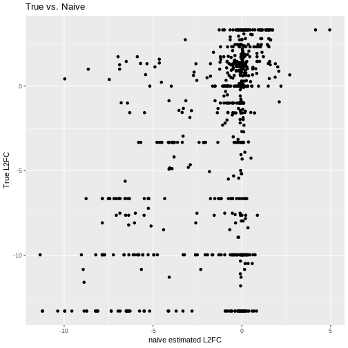
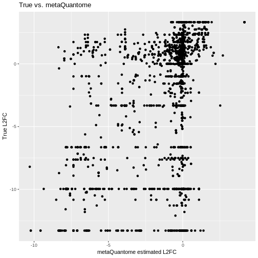

```r
knitr::opts_chunk$set(message=FALSE, warning=FALSE)
```


```r
options(stringsAsFactors = FALSE)
flash <- read.delim("estimated_amounts/mqome_inputs/flash.tab")
func <- read.delim("estimated_amounts/mqome_inputs/func.tab")
library(dplyr)
library(tidyr)
library(reshape2)
library(stringr)
joined <- left_join(flash, func, by = "peptide") %>%
    transform(go = strsplit(go, ",")) %>%
    unnest(go) %>%
    select(go, starts_with("UPS")) %>%
    melt()

summed <- joined %>%
    group_by(go, variable) %>%
    summarise(int = sum(value, na.rm =T))

grped <- summed %>%
    mutate(grp = str_sub(variable, 0, 4)) %>%
    group_by(go, grp) %>%
    summarise(meanfn = mean(int, na.rm=TRUE)) %>%
    select(go, meanfn, grp) %>%
    dcast(go ~ grp, value.var = "meanfn") %>%
    mutate(fc = log2(UPS2/UPS1)) %>%
    filter(is.finite(fc))
```


```r
true <- read.delim('true_amounts/mqome_outputs/true_out.tab') %>%
    mutate(true_fc = ups2_mean - ups1_mean)
```

The comparison I used here is to compare the true UPS2/UPS1 log2 fold change (L2FC) for each GO term to the UPS2/UPS1 log2 fold change obtained through either the 'naive' approach or using metaQuantome. By 'naive' approach, I mean just summing up the intensities for the peptides annotated with each go term.

I use two comparisons:

1. To measure how close each method approximates the true L2FC, I calculate the mean sum of squares between the true L2FC and the estimated L2FC. I also plot the two points to show visual goodness of fit. 
2. The percentage of the UPS GO terms quantified with each method. 

## True fold changes compared to 'Naive' Approach


```r
true_naive <- inner_join(true, grped, by = c("id" = "go")) %>%
        select(id, name, fc, true_fc)
library(ggplot2)
ggplot(true_naive) +
    geom_point(aes(x = fc, y = true_fc)) +
    labs(x = "naive estimated L2FC",
         y = "True L2FC",
         title = "True vs. Naive") 
```



```r
naive_err <- mean((true_naive$fc - true_naive$true_fc)^2, na.rm = T)
cat('Naive method MSE: ', naive_err)
```

```
## Naive method MSE:  26.75425
```

```r
naive_gos <- sum(is.finite(true_naive$fc))
cat('Naive method number of gos:', naive_gos)
```

```
## Naive method number of gos: 712
```

## With metaQuantome approach


```r
mqome_est <- read.delim('estimated_amounts/mqome_outputs/ups_out.tab') %>%
    mutate(mqome_fc_est = UPS2_mean - UPS1_mean) %>%
    select(id, mqome_fc_est)

true_mqome <- inner_join(true, mqome_est, by = "id") %>%
    select(id, name, mqome_fc_est, true_fc)

ggplot(true_mqome) +
    geom_point(aes(x = mqome_fc_est, y = true_fc)) +
    labs(x = "metaQuantome estimated L2FC",
         y = "True L2FC",
         title = "True vs. metaQuantome") 
```



```r
mqome_err <- mean((true_mqome$mqome_fc_est - true_mqome$true_fc)^2, na.rm=T)
cat('metaQuantome MSE: ', mqome_err)
```

```
## metaQuantome MSE:  25.23472
```

```r
mqome_gos <- sum(is.finite(true_mqome$mqome_fc_est))
cat('metaQuantome GOs: ', mqome_gos)
```

```
## metaQuantome GOs:  1716
```

## Final result


```r
ntrue <- nrow(true)
res <- data.frame('method' = c('naive', 'metaquantome', 'true'),
                  'go terms' = c(naive_gos, mqome_gos, ntrue),
                  'mse' = c(naive_err, mqome_err, 'NA'))
library(kableExtra)
res %>%
    knitr::kable() %>%
    kable_styling()
```

<table class="table" style="margin-left: auto; margin-right: auto;">
 <thead>
  <tr>
   <th style="text-align:left;"> method </th>
   <th style="text-align:right;"> go.terms </th>
   <th style="text-align:left;"> mse </th>
  </tr>
 </thead>
<tbody>
  <tr>
   <td style="text-align:left;"> naive </td>
   <td style="text-align:right;"> 712 </td>
   <td style="text-align:left;"> 26.7542489563297 </td>
  </tr>
  <tr>
   <td style="text-align:left;"> metaquantome </td>
   <td style="text-align:right;"> 1716 </td>
   <td style="text-align:left;"> 25.2347185710186 </td>
  </tr>
  <tr>
   <td style="text-align:left;"> true </td>
   <td style="text-align:right;"> 3130 </td>
   <td style="text-align:left;"> NA </td>
  </tr>
</tbody>
</table>
