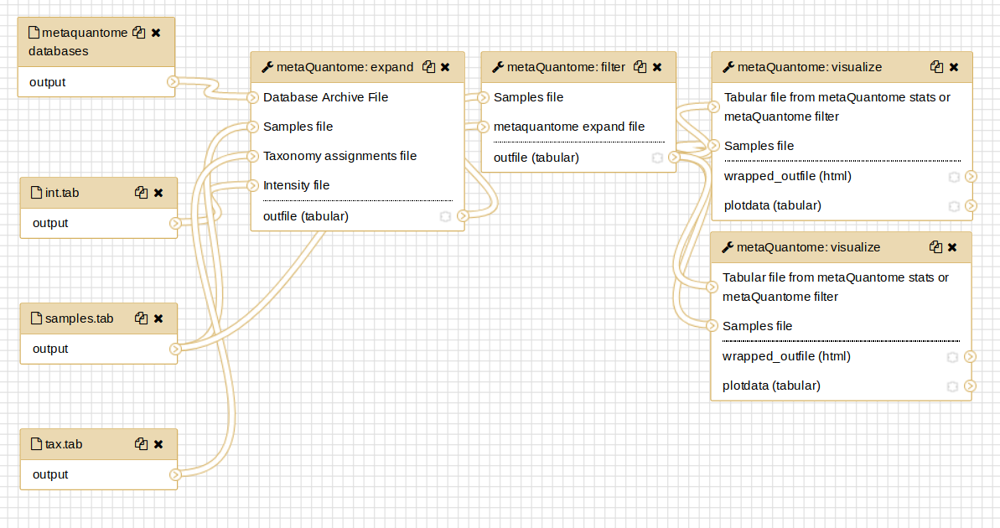
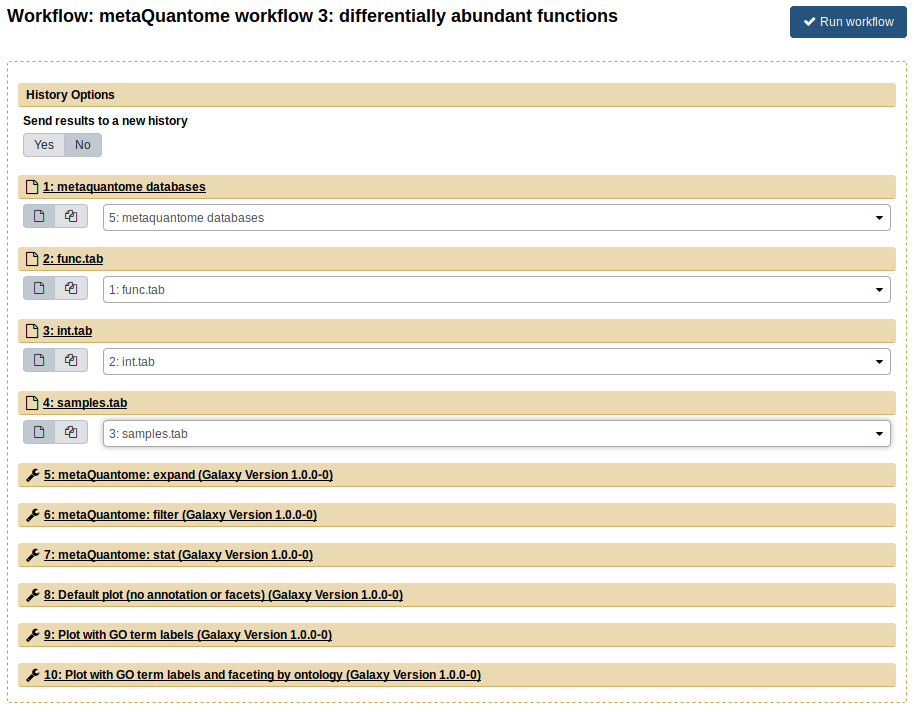

# metaQuantome Galaxy Tutorial

## Accessing the Metaproteomics Gateway

Go to <https://z.umn.edu/metaproteomicsgateway>.  This website is one of the public Galaxy gateways hosted on Jetstream (<https://jetstream-cloud.org/>), a cloud-based resource for scientific computing and research. The Galaxy installation on this website is maintained by the Galaxy-P team at the University of Minnesota.

## Registering

This Galaxy instance requires that all users register to access tools and workflows.  To register, perform the following steps:

1. Click on the  "Login or Register" tab and click on "Register". Enter an email address, password and public name of choosing. [NOTE: Users choosing to remain anonymous can enter an email such as "guest@galaxyp.org", along with a password and a public name of your choosing. Also, note that this instance is for training purposes only, not for long-term use or testing with large datasets and the passwords are non-retrievable]

2. Once registered, click on the "User" tab and click on "Login" with your user credentials.

## The Galaxy Interface

The Galaxy interface is divided into three panels: a *Tool pane* on the left side of the interface, a *Center pane/Main viewing pane* in the center and a *History* pane to the right. The *Tool* pane consists of organized list of software tools available to users in a particular Galaxy instance. The *Main* view displays the information regarding the tool, input/output from the tool, workflow editing space, etc. The *History* pane contains an ordered list of datasets that were uploaded and the outputs generated while running the tools during data analysis.  The active history is shown in the *History Pane* of the user interface.

Tools in Galaxy can be run individually or as part of a *workflow*, which is a linked sequence of steps that takes some input data and provides results. In this tutorial, we'll start with running tools individually in the first analysis, and then we'll run 4 workflows.

## Import data

The data used are a downsampled version of data from Rudney, et al. *Microbiome* [doi:10.1186/s40168-015-0136-z](https://dx.doi.org/10.1186/s40168-015-0136-z), using 3 pairs and 1000 peptides (and, as such, these results are not representative of the full dataset). For more detail about the data, see the *MCP* manuscript associated with this tutorial.

## Analysis 1: Most Abundant Taxa

In Galaxy, to run any tool/workflow, the appropriate data must be provided. Hence, the first step is to import the required input datasets. To do that, click on "Shared Data" &rarr; "Histories" &rarr; " **metaQuantome MCP: analysis 1, step-by-step**". Then, click on "Import History" to import this history, which contains the input files for this analysis. The history consists of three tabular datasets: the functional annotation file (`func.tab`), quantification file (`int.tab`) and taxonomy annotation file (`tax.tab`). You can preview the files in the *Center pane* by clicking on the eye icon:

### Database module

Next, we have to download the databases that are used to expand the hierarchies. To do this, click on the "metaQuantome" section in the Tool Pane (on the left side of the Galaxy interface), and click on "metaQuantome: database". The center pane should now look like this:

Usually, it's fine to download all 3 databases - the only situation in which you wouldn't want to is when you are short on disk space and are absolutely sure you don't need the taxonomy database, which is the largest. Click 'Execute', and a new dataset will appear in the History Pane (on the right side of the Galaxy interface).

### Samples Module 

Next, we'll create the "samples file", which specifies the experimental design. Click on "metaQuantome: create samples file" in the Tool Panel. We'll use the `int.tab` file to create the samples file, so for the "Sample file creation method", choose "Select samples from the header of an existing file", then choose `int.tab` for the "File with group name headers" parameter:

We have two experimental conditions: NS and WS. Click "Insert Samples", and name the first group "NS". Then, select the columns that correspond to the NS group - this is columns 3, 5, and 7:

Repeat the process for WS (columns 2, 4, and 6):

Now, click "Execute". You will see a new tabular file appear in the history pane. As before, you can preview the file by clicking on the eye icon.

### Expand module

Next, we'll expand the taxonomic annotations using `metaQuantome: expand`. To do this, click on "metaQuantome: expand" in the Tool Panel. The center pane will show the `expand` tool interface (this is before any parameters have been changed):

First, put in the following parameter values:

* Database archive file: the output from "metaQuantome: database"
* Samples file: the output from "metaQuantome: create samples file"
* Mode: Taxonomic analysis

After you select "Taxonomic analysis", you'll see new options open up below that selection. Input these parameters:

* Taxonomy assignments file: `tax.tab`
* "Taxonomy file: peptide column name": `peptide` (the default) 
* Taxonomy column name: `lca`
* Intensity file: `int.tab`
* "Intensity file: peptide column name": `peptide` (the default)

Now, click "Execute". If the output dataset turns green - great! Proceed to the next step. If the dataset turns red, that means an error has occurred. Please double check your parameters against the below image and try again:

Note that the dataset numbers may be slightly different, depending on the order of datasets in your history, but the names should be the same.

If you continue to get an error, please post a detailed message on <https://github.com/galaxyproteomics/tools-galaxyp/issues>.

### Filter module

Next, we'll filter the expanded set of taxa to only those that were quantified in 2 samples per experimental condition. To do this, click "metaQuantome: filter" in the metaQuantome tool panel section. The parameters should be as follows:

* Mode: Taxonomic analysis
* Samples file: output from metaQuantome samples (same as before)
* metaquantome expand file: output from metaQuantome expand
* min_peptides: 1
* min_pep_nsamp: 1
* min_children_non_leaf: 2
* min_child_nsamp: 1
* qthreshold: 2

Your tool should look similar to this image:

Now, click "Execute". A new history dataset should appear in the right-hand pane. If the dataset turns red, double check your parameters and try again.

### Viz module

With the viz module, we can visualize the most abundant taxa. Click "metaQuantome: visualize" in the Tool Panel.

The first three parameters should be as follows:

* Tabular file from metaQuantome stats or metaQuantome filter: output from metaQuantome: filter
* Samples file: output from metaQuantome: create samples file
* Mode: Taxonomic analysis

Once you choose "Taxonomic analysis" as the mode, you will see the available plot options. We'll use the ""barplot".

We'll start with the 5 most abundant genera in NS. To do this, we need to select the rank and the mean intensity column.

For rank, use the drop-down menu to select "genus". The mean intensity column is named by metaQuantome as `<group name>_mean` - in this case, `NS_mean`. Finally, we'll select 5 terms to display and Blue bars. The tool should look like this:

Click "Execute". For barplots, this tool produces two outputs: one is a plot image, wrapped in an HTML file, and the other is a tabular file with the plot data. The plotted values are in the `NS_mean` column.

Now, we'll do the same but for WS. Everything can stay the same except the mean intensity column name, which should be changed to `WS_mean`. Once again, click "Execute" and view the plot!

For the remaining analyses, we'll run workflows, which are a compact way to store and share a series of steps. For extra practice, you could recreate the workflows by running individual tools.

.

## Running the workflows

We'll start with a workflow version of Analysis 1, then go on to other analyses. If you have trouble with any of the workflows, you can import the workflow result histories - for workflow 1, the history is called "metaQuantome workflow 1 results: most abundant taxa", and so on.

### Workflow 1: Most Abundant Taxa

First, import the history called "metaQuantome MCP: workflow input data". To keep track of your histories, it's suggested that you give them clear and informative names. Here, let's name it "metaQuantome workflow 1".

The first workflow is the "metaQuantome Workflow 1: Most abundant Taxa". This workflow is used to identify the most abundant taxa in an experiment.

To import this workflow, go to Shared Data &rarr; "Workflows" &rarr; "metaQuantome workflow 1: most abundant taxa". If you don't see this workflow, try searching "metaQuantome" in the search box. 

Now, click on Import Workflow:

Once the workflow is imported, it will now be available in the "Workflow" tab in the Galaxy instance.

First, we'll visualize the steps in the workflow. Go to the "Workflow" tab, and click on the downward-pointing arrow next to "metaQuantome workflow 1: most abundant taxa".

Then, select the "Edit" option. This will display the *Workflow Editor*, which offers the best view of a workflow and is one place that workflows can be built.

By clicking on each of the steps, you can see the parameters that are used in that run of the tool.

Now, go back the the "Workflow" tab. Click the dropdown arrow and select the "Run" option. The workflow will now open in the Main viewing pane. Next, to run the workflow, appropriate inputs have to be selected. For the "Taxonomic annotation file" field, select the `tax.tab` file. For the "Samples" file field, select `samples.tab`. Finally, for the "Intensity file" field, select the `int.tab` file. The center pane should now look like this:

Finally, click "Run Workflow". Each of the steps should appear, turn yellow, and then turn green (indicating success). The workflow has two main outputs: a plot of the highest-abundance species for the no sucrose condition (NS) and another plot for the with sucrose condition (WS). Again, all of the files can be viewed by clicking the eye image . You can compare these results with the results you got in the step-by-step analysis - they should be the same!

### Workflow 2: Cluster Analysis of Taxonomy

To start, we'll import the input data to a new history and rename it (the history named "metaQuantome MCP: workflow input data").

Then, import the workflow "metaQuantome workflow 2: cluster analysis of taxonomy". The inputs are the same as in the first workflow. After running `expand` and `filter`, this workflow creates a PCA plot and the second creates a heatmap.

### Workflow 3: Differentially Abundant Functions

Once again, import the input data to a new history and rename it. In workflow 3, we perform functional differential abundance analysis with metaQuantome. For this, import workflow 3, "metaQuantome workflow 3: differentially abundant functions". The inputs for workflow 3 are `func.tab` (the "Function annotation file"), `samples.tab` (the "Samples file"), and `int.tab` (the "Intensity file"). After selecting the correct inputs, the center pane should look like this:

The outputs from this workflow are volcano plots, which plots the log2 fold change against the -log10 p value for each GO term. The green points are those GO terms that are below 5% FDR and had a greater-than-2-fold change. The workflow outputs 3 volcano plots, showing different options available within metaQuantome: adding text to the differentially expressed terms and plotting biological process, molecular function, and cellular component separately.

### Workflow 4: Function-Taxonomy Interaction
The fourth workflow analyzes function and taxonomy together. First, import the input data again, then import the workflow "metaQuantome workflow 4: function taxonomy interaction". Now, we use all 4 inputs from the "Imported: metaquantome MCP tutorial data" history, as follows:

- `func.tab` &rarr; Functional annotation file
- `tax.tab` &rarr; Taxonomic annotation file
- `samples.tab` &rarr; Samples file
- `int.tab` &rarr; Intensity file

The Center Pane should look like this when you are ready to run:

Now, click "Run workflow". The outputs are barplots showing the taxonomic distribution of the GO term for "carbohydrate metabolic process" (GO:0005975) for NS (blue) and WS (orange)

## Contact
If you have any problems with the server or the workflows, please contact the Galaxy-P team by posting an issue on <https://github.com/galaxyproteomics/tools-galaxyp/issues>

## Other training materials

Galaxy has a wealth of training material hosted at the [Galaxy Training webpage](https://galaxyproject.github.io/training-material/). For new users, the [Introduction to Galaxy Analyses](https://galaxyproject.github.io/training-material/topics/introduction/) is a great place to start.
